> 2025-04-27 project-구글 애널리틱스를 활용한 사용자 분석

# 목차

- [이 글을 작성하는 이유](#이-글을-작성하는-이유)
- [구글 애널리틱스란?](#구글-애널리틱스란)
  - [도입 계기](#도입-계기)
  - [얻을 수 있는 지표](#얻을-수-있는-지표)
- [데이터에 대한 의문점](#데이터에-대한-의문점)
  - [데이터 수집 기간](#데이터-수집-기간)
  - [외부 이벤트](#외부-이벤트)
  - [게임 내부 상황](#게임-내부-상황)
- [데이터 알아보기](#데이터-알아보기)
  - [이탈률](#이탈률)
  - [모바일 유저](#모바일-유저)
- [결론 및 개선 방향](#결론-및-개선-방향)

---

# 이 글을 작성하는 이유

이 글은 **구글 애널리틱스를 실제 프로젝트에 적용한 경험을 정리하고**, 이를 통해 어떤 효과를 얻었는지 공유하기 위해 작성되었다.

웹 페이지에 구글 애널리틱스를 도입한 이후, 방문자 수, 체류 시간, 기기 유형 등 다양한 데이터를 확인할 수 있었고, **특정 기능 도입 이후 이탈률이 감소하고 참여율이 증가한 것**을 통해 **기능의 효과를 데이터로 입증할 수 있었다.**

이러한 경험은 데이터 분석이 단순한 숫자 나열을 넘어, **사용자 경험 개선과 서비스 전략 수립에 실질적인 도움을 줄 수 있다는 사실**을 보여주었다.

또한, 수집 기간이 짧거나 외부 요인으로 인한 이상치가 포함될 경우 **데이터의 신뢰성에 한계가 있다는 점**도 함께 깨달았다. 이로 인해 장기적인 데이터 수집과 지속적인 모니터링의 중요성을 인식하게 되었으며, **직접 통제할 수 있는 요소에 집중한 분석이 가장 실질적인 인사이트를 줄 수 있다는 점**을 강조하고자 한다.

---

# 구글 애널리틱스란?

```
GA4는 미래의 측정 방식을 대비해 설계된 새로운 유형의 속성입니다.

- 웹사이트와 앱 데이터를 모두 수집하여 고객 여정을 더욱 자세히 파악
- 세션 기반 데이터 대신 이벤트 기반 데이터 사용
- 쿠키 없는 측정, 행동 및 주요 이벤트 모델링과 같은 개인 정보 보호 설정 포함
- 예측 기능으로 복잡한 모델이 없는 가이드 제공
- 미디어 플랫폼에 직접 통합하여 웹사이트 또는 앱에서 더 편리하게 작업
```

구글 애널리틱스 중에서 차세대 애널리틱스인 [Google 애널리틱스 4](https://support.google.com/analytics/answer/10089681?hl=ko&ref_topic=14089939&sjid=16312974303916066436-NC)를 말한다.

---

## 도입 계기

웹 사이트를 배포한 다음날 유저가 어떤 페이지에 접속했고 몇 명이 방문하였고, 등의 정보를 알고 싶어졌다.

며칠 전에 진행한 번개팅 팀 프로젝트에서 팀장님이 구글 애널리틱스를 적용했던 것이 생각나 개인 프로젝트에도 적용하면 어떨까 하는 생각에 도입하였다.

구글 애널리틱스를 도입하면 아래와 같이 많은 정보를 제공받을 수 있다. 이또한 좋은 점이지만, 제일 좋은 점은 **무료**로 사용할 수 있다는 점이다. 적용하는 방법 또한 간단하다.

도메인 혹은 배포된 페이지 URL만 있다면 구글 애널리틱스를 적용할 수 있다.

이전에 작성한 원숭이 시뮬레이터는 배포된 페이지 URL을 이용해서 구글 애널리틱스를 적용했다.

배포할 당시에 같이 적용하지 못하고 바로 다음날에 도입하여 첫째날 수집된 데이터가 없다는 것은 아쉬울 따름이다.

---

## 얻을 수 있는 지표

구글 애널리틱스에 들어가면 크게 네 가지로 분류가 된다.

**홈, 보고서, 탐색, 광고**

- 홈

<figure style="text-align: center;">
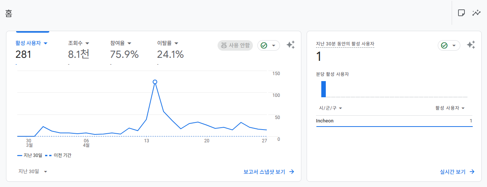
    <figcaption>구글 애널리틱스 홈</figcaption>
</figure>

<figure style="text-align: center;">
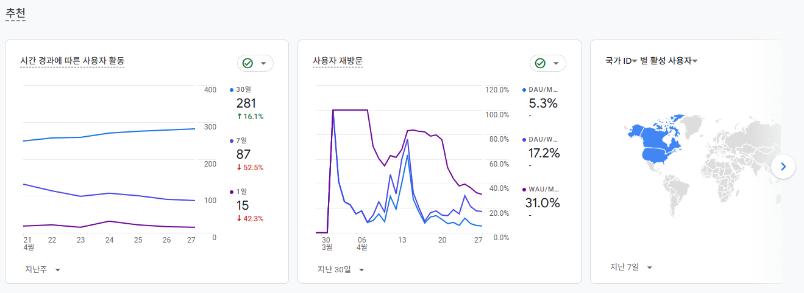
    <figcaption>구글 애널리틱스 홈 - 추천</figcaption>
</figure>

홈에서는 위와 같이 대표적으로 알 수 있는 지표들을 설정하고 추천 지표도 보여주고 있다.

여기에서는 특정 통계에 대한 알림을 받을 수 있는데, 재밌는 점은 이메일 알림을 받을 통계를 직접 만들 수 있다는 것이다.

<figure style="text-align: center;">
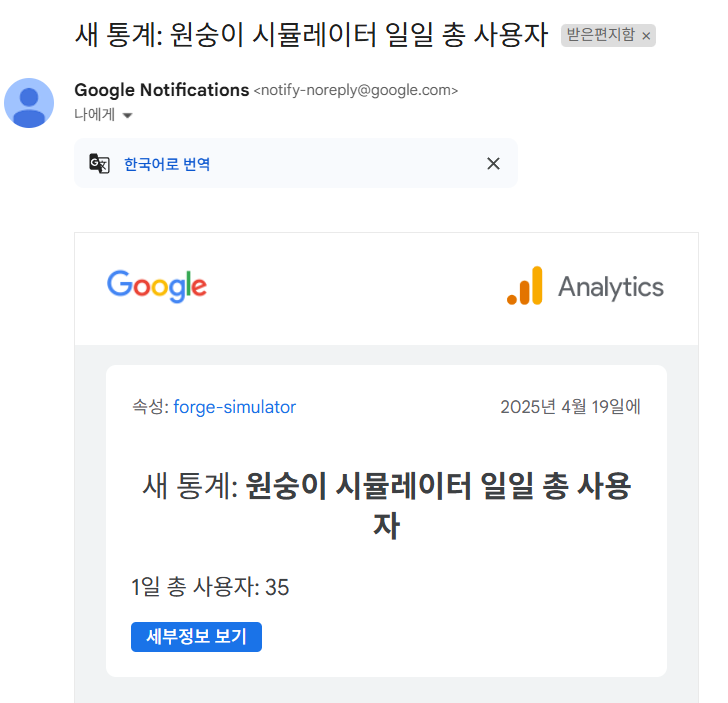
</figure>

기존에도 **일일 사용자 수 이상** 이라는 비슷한 통계가 있지만 이는 말 그대로 설정한 사용자 수 이상으로 사용자가 생겨야 하기 때문에 일일 사용자 수를 알고 싶어서 따로 설정을 해주었다.

사이트에서는 **맞춤 통계**에서 설정한 통계에 대한 알림을 확인할 수 있다.

<figure style="text-align: center;">
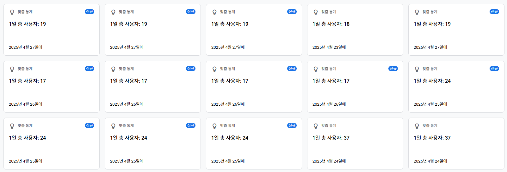
<figcaption>구글 애널리틱스 insights</figcaption>
</figure>

~~이유는 모르겠지만 똑같은 날짜를 여러 번 보내기도 하고 순서도 뒤죽박죽으로 보내는 경우가 많다~~

---

# 데이터에 대한 의문점

한 달간의 데이터 수집을 바탕으로 글을 작성하려 했을 때, 스스로 여러 의문점을 갖게 되었다.

## 데이터 수집 기간

2025년 3월 31일부터 4월 27일까지, 약 한 달간 수집된 데이터를 통해 **유저의 행동 패턴이나 장기적인 동향을 분석하는 것은 무리**라고 판단했다.

이번 분석은 어디까지나 **초기 데이터 기반의 탐색적 분석**에 해당하며, 앞으로 장기적인 데이터 수집과 지속적인 모니터링이 예정되어 있기 때문에, 현재의 데이터는 참고용으로 활용하되 **절대적인 신뢰는 경계하려 한다**.

## 외부 이벤트

원래는 지인들에게만 웹 페이지를 공유했지만, 이후 공식 채널을 통해 외부에 페이지를 홍보하면서 트래픽이 급증하는 현상이 나타났다. 이는 **일시적으로 평소와는 다른 사용자 패턴을 유발했을 가능성**이 있다.

그러나 홍보 당일 이후부터는 **트래픽이 평소 수준으로 안정화**되었으며, 원래 데이터의 표본 수가 작았다는 점에서, 이번 이벤트로 인해 **오히려 더 다양한 사용자의 행동을 관찰할 수 있는 기회가 되었다고 볼 수 있다**.

## 게임 내부 상황

이 웹사이트가 연동된 게임 *원숭이 시뮬레이터*는 **강화가 주요 콘텐츠**인 게임이다. 하지만 최근 몇 달간 강화할 필요성을 부여하는 **새로운 콘텐츠가 업데이트되지 않았고**, 3\~4월 예정이었던 업데이트도 지속적으로 연기되었다.

이로 인해 유저들의 이탈이 가속화되었고, **웹사이트 방문 자체의 동기가 줄어든 상황**이 발생했다. 실제로 외부 홍보 이후에도 시간 경과에 따라 사용자 활동은 점차 감소하는 양상을 보이고 있다.

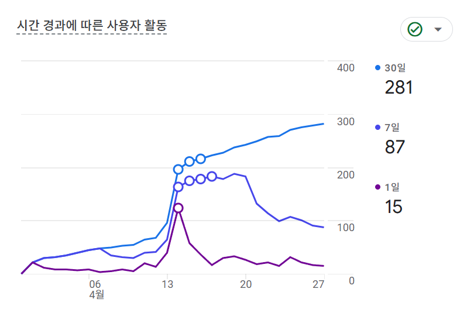

이러한 상황은 내가 통제할 수 있는 영역이 아니므로, **분석에 있어 컨트롤 가능한 범위에 집중하고 그 외의 변수는 고려하는 방식**으로 접근하려 한다.

---

# 데이터 알아보기

## 이탈률

[이탈률](https://support.google.com/analytics/answer/12195621)에 대해 알아보자. [애널리틱스 고객센터](https://support.google.com/analytics)에서 설명하는 이탈률은 다음와 같다.

참여율과 이탈률은 Google 애널리틱스에서 웹사이트 또는 앱의 사용자 참여 발생 시간을 측정하고 분석할 수 있는 중요한 측정항목입니다.

두 측정항목 모두 참여 세션을 기준으로 정의됩니다.

- 세션은 사용자가 웹사이트 또는 앱과 상호작용하는 기간입니다.
- 참여 세션은 다음 기준 중 하나를 충족하는 세션입니다.
  - 10초 이상 지속됨
  - [**주요 이벤트**](https://support.google.com/analytics/answer/9355848)가 있음
  - 화면 또는 페이지 조회수가 2회 이상임

참여율은 웹사이트 또는 모바일 앱에서 **참여 세션의 비율**입니다. 이탈률은 참여율과는 반대입니다. 이탈률은 **참여하지 않은 세션의 비율**입니다.

**참고:** 참여율 및 이탈률을 더 정확하게 계산할 수 있도록 모든 이벤트에 `is_engaged_session_event`가 추가되었습니다.

즉, 참여율은 어떤 형태로든 의미 있는 참여가 이루어진 웹사이트 또는 앱 방문의 비율을 측정하는 데 도움이 됩니다.

전체 이탈률과 **리더보드 기능 적용** 이후 이탈률을 살펴보자.

<figure style="text-align: center;">
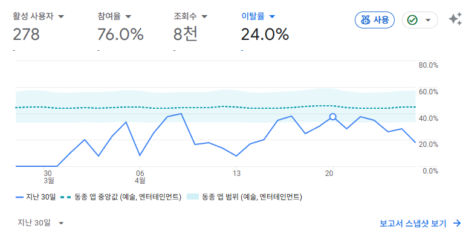
    <figcaption>전체 이탈률</figcaption>
</figure>

<div style="display: flex; gap: 10px; justify-content: justify-between; align-items: center;">
  <figure style="text-align: center;">
    
    <figcaption>리더보드 기능 적용 전 이탈률</figcaption>
  </figure>
  <figure style="text-align: center;">
    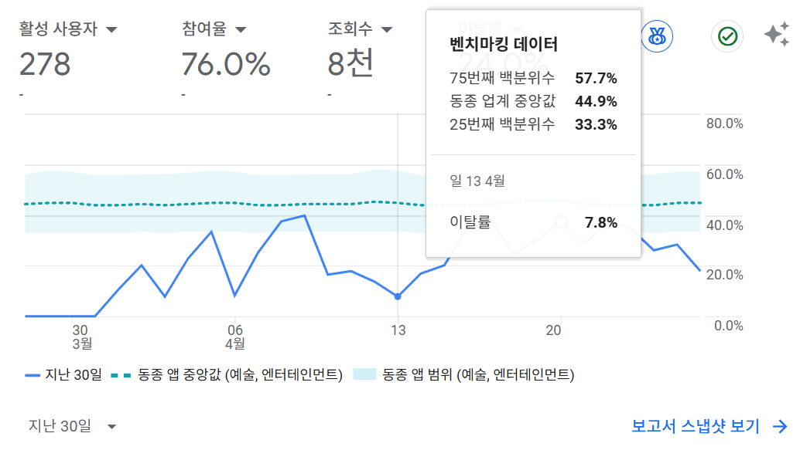
    <figcaption>리더보드 기능 적용 후 이탈률</figcaption>
  </figure>
</div>

4월 11일, 리더보드 기능 도입 이후 유저 이탈률은 일시적인 변동을 보였지만 **전반적으로 긍정적인 흐름**을 나타냈다. 특히 기능 도입 직후인 4월 13일에는 이탈률이 **7.8%까지 급감**, 도입 직전 대비 **약 10%p 하락**하며, 기능에 대한 초기 반응이 매우 긍정적이었음을 보여준다.

하지만 이후 이탈률은 점차 원래 수준으로 회복되었다. 이에 대해 두 가지 개인적인 해석이 가능하다.

첫째, **리더보드에 등록된 이름은 하루 동안만 유지되는 구조**였기 때문에, 유저가 매일 리더보드에 이름을 올려야 할 명확한 동기나 보상이 부족했다. 이러한 **지속 동기 부여의 부재**가 이탈률 증가에 영향을 준 것으로 보인다.

둘째, **게임 외적인 요인**도 이탈률에 영향을 미쳤다. 예를 들어, **예정된 업데이트의 지연이나 개발 일정 변경** 등으로 인해 유저가 웹 페이지를 방문할 이유가 줄어들며, 자연스럽게 이탈률이 다시 상승한 것으로 해석된다.

## 모바일 유저

**사용자 - 기술 - 기술 세부정보 - 플랫폼 / 기기 카테고리**에서 기기 카테고리별 활성 사용자를 확인할 수 있었다.

웹 사이트에 **pwa 기능**을 적용한 이후 **모바일 사용자**의 변화를 알아보자.

<figure style="text-align: center;">
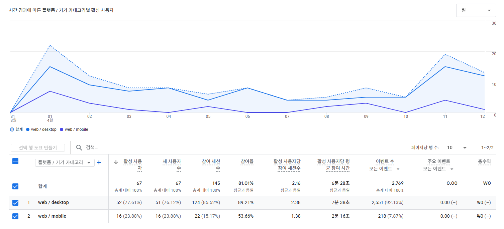
    <figcaption>pwa 적용 이전</figcaption>
</figure>
<figure style="text-align: center;">
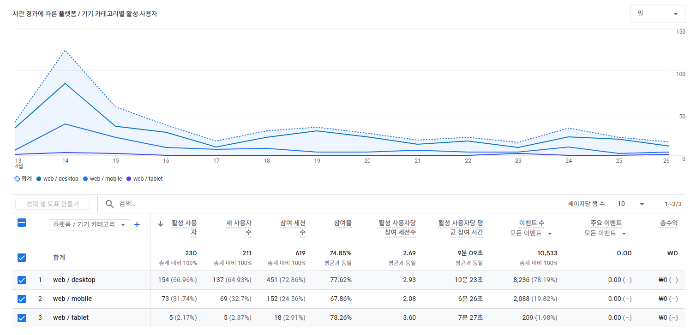
    <figcaption>pwa 적용 이후</figcaption>
</figure>

- 새 사용자

  - 적용 이전 모바일 유저는 새 사용자 67명 대비 16명으로, **23.88%**에 해당한다.

  - 적용 이후 모바일/태블릿 유저는 새 사용자 211명 대비 74명으로, **35.07%**에 해당한다.

수치로만 본다면 새로운 사용자를 대략 11% 정도 증가하였다.

<div style="display: flex; gap: 10px; justify-content: justify-between; align-items: center;">
<figure style="text-align: center;">
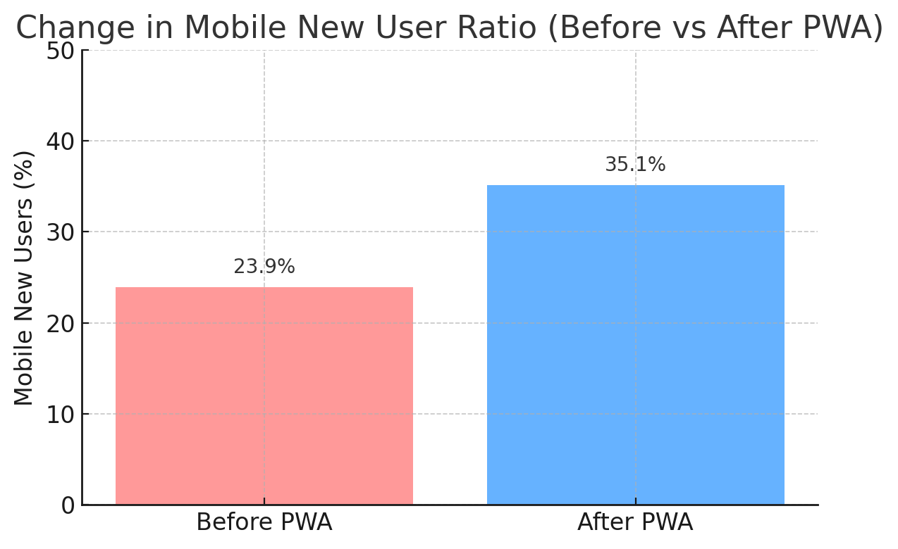
    <figcaption>pwa 적용 전후 비율</figcaption>
</figure>

<figure style="text-align: center;">
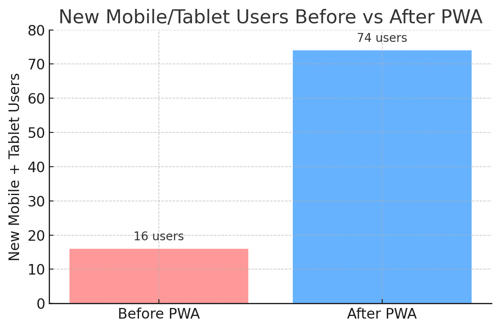
    <figcaption>pwa 적용 전후 새 사용자 수</figcaption>
</figure>
</div>

# 결론 및 개선 방향

이번 프로젝트를 통해 단순히 유저 수를 파악하는 것 이상의 의미 있는 인사이트를 도출할 수 있었다. 특히 **리더보드 기능 추가**, **PWA 적용** 등 기능별로 사용자 반응의 변화를 수치로 확인할 수 있었던 점은 큰 수확이었다.

다만, 여전히 다음과 같은 한계와 개선 여지가 존재한다:

- **데이터 수집 기간의 부족**

  짧은 기간에 수집된 데이터는 일시적인 이상치나 외부 변수에 크게 영향을 받을 수 있다. 앞으로는 **최소 3개월 이상 장기적인 데이터 수집**을 목표로 할 예정이다.

- **지표 해석의 애매함**

  단일 수치만 보고 개선 여부를 판단하기보다, 다양한 지표(이탈률, 세션 길이, 재방문율 등)를 **복합적으로 고려**하는 방향으로 전환할 필요가 있다.

- **게임 콘텐츠와의 연동 부족**

  게임 업데이트가 사용자 행동에 직접적인 영향을 미치므로, **게임 내 업데이트 주기와 연동한 분석 계획**도 함께 수립해야 한다.

이번 분석은 초기 데이터를 기반으로 한 탐색적 접근이었으며, 앞으로 장기적인 관찰과 반복적인 분석을 통해 보다 정교한 사용자 이해와 전략적 개선이 가능할 것으로 기대된다.

---
