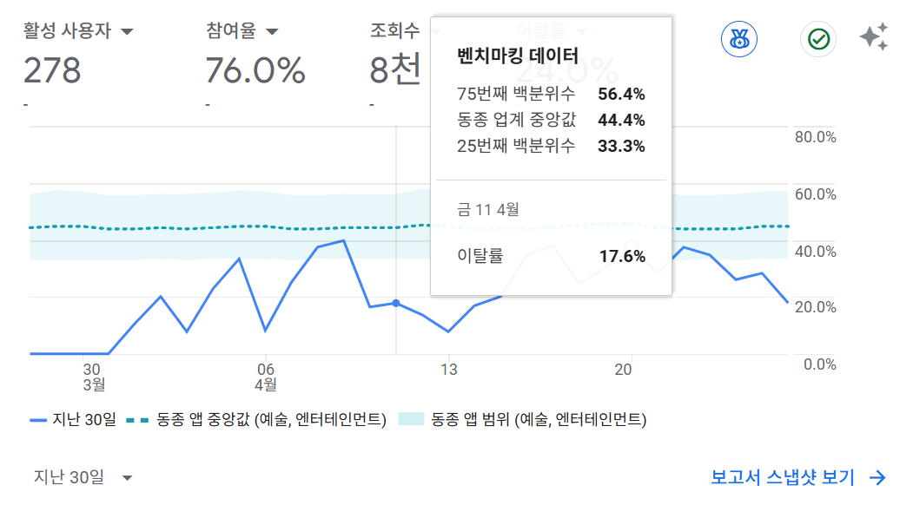

> 2025-04-27 project-구글 애널리틱스를 활용한 사용자 분석

# 구글 애널리틱스를 도입하게 된 계기

웹 사이트를 배포한 다음날 유저가 어떤 페이지에 접속했고 몇 명이 방문하였고, 등의 정보를 알고 싶어졌다.

며칠 전에 진행한 번개팅 팀 프로젝트에서 팀장님이 구글 애널리틱스를 적용했던 것이 생각나 개인 프로젝트에도 적용하면 어떨까 하는 생각에 도입하였다.

구글 애널리틱스를 도입하면 아래와 같이 많은 정보를 제공받을 수 있다. 이또한 좋은 점이지만, 제일 좋은 점은 **무료**로 사용할 수 있다는 점이다. 적용하는 방법 또한 간단하다.

도메인 혹은 배포된 페이지 URL만 있다면 구글 애널리틱스를 적용할 수 있다.

이전에 작성한 원숭이 시뮬레이터는 배포된 페이지 URL을 이용해서 구글 애널리틱스를 적용했다.

배포할 당시에 같이 적용하지 못하고 바로 다음날에 도입하여 첫째날 수집된 데이터가 없다는 것은 아쉬울 따름이다.

---

# 구글 애널리틱스란?

```
GA4는 미래의 측정 방식을 대비해 설계된 새로운 유형의 속성입니다.

- 웹사이트와 앱 데이터를 모두 수집하여 고객 여정을 더욱 자세히 파악
- 세션 기반 데이터 대신 이벤트 기반 데이터 사용
- 쿠키 없는 측정, 행동 및 주요 이벤트 모델링과 같은 개인 정보 보호 설정 포함
- 예측 기능으로 복잡한 모델이 없는 가이드 제공
- 미디어 플랫폼에 직접 통합하여 웹사이트 또는 앱에서 더 편리하게 작업
```

구글 애널리틱스 중에서 차세대 애널리틱스인 [Google 애널리틱스 4](https://support.google.com/analytics/answer/10089681?hl=ko&ref_topic=14089939&sjid=16312974303916066436-NC)를 말한다.

---

# 구글 애널리틱스로 얻을 수 있는 지표

구글 애널리틱스에 들어가면 크게 네 가지로 분류가 된다.

**홈, 보고서, 탐색, 광고**

## 홈

<figure style="text-align: center;">

    <figcaption>구글 애널리틱스 홈</figcaption>
</figure>

<figure style="text-align: center;">

    <figcaption>구글 애널리틱스 홈 - 추천</figcaption>
</figure>

홈에서는 위와 같이 대표적으로 알 수 있는 지표들을 설정하고 추천 지표도 보여주고 있다.

여기에서는 특정 통계에 대한 알림을 받을 수 있는데, 재밌는 점은 이메일 알림을 받을 통계를 직접 만들 수 있다는 것이다.

<figure style="text-align: center;">

</figure>

기존에도 **일일 사용자 수 이상** 이라는 비슷한 통계가 있지만 이는 말 그대로 설정한 사용자 수 이상으로 사용자가 생겨야 하기 때문에 일일 사용자 수를 알고 싶어서 따로 설정을 해주었다.

사이트에서는 **맞춤 통계**에서 설정한 통계에 대한 알림을 확인할 수 있다.

<figure style="text-align: center;">

<figcaption>구글 애널리틱스 insights</figcaption>
</figure>

~~이유는 모르겠지만 똑같은 날짜를 여러 번 보내기도 하고 순서도 뒤죽박죽으로 보내는 경우가 많다~~

---

# 데이터의 의문점

우선, 대략 한 달동안 데이터 수집 기간을 가졌고 이에 대해 글을 쓰고자 할 때 스스로 의문점을 가지게 되었다.

## 데이터 수집 기간

2025년 3월 31일부터 2025년 4월 27일까지 대략 한 달간 수집한 데이터를 가지고 유저의 패턴이나, 동향과 같은 장기적인 부분을 예상하고 분석하는 것은 무리라고 생각했다.

하지만, 이는 초기 분석에 불과하고 장기적인 추가 데이터 수집과 모니터링이 예정되어 있기 때문에 지금 분석하는 데이터를 무조건적으로 신뢰하지 않고 초기 분석에 의의를 둘 생각이다.

## 외부 이벤트

원래는 아는 사람들에게만 페이지를 알려주었는데 공식적인 곳에서 다른 사람들에게 페이지를 홍보하면서 트래픽이 급증한 부분이 있다. 이는 분명히 평소와 다른 데이터를 수집하게 되었고, 이후 데이터에도 영향을 미쳤을 것이다.

하지만 홍보 당일 이후 평소와 비슷한 수치로 유지가 되었고, 원래 데이터의 표본 수가 크지 않기 때문에 오히려 표본 수가 늘고 난 이후 사용자의 동향을 살펴보기 쉽다고 판단했다.

## 게임 내부 상황

원숭이 시뮬레이터는 게임 내 강화가 주 목적인 시뮬레이터 이다. 그러나, 강화를 할 명분이 없다면 시뮬레이션할 이유도 없을 것이다. 현재 게임 내 상황은 수직 컨텐츠(스펙이 높은 사람들을 위한 컨텐츠) 뿐만 아니라 새로운 컨텐츠가 나오지 않고 있다.

정확히 말하자면 3월, 4월에 예정된 업데이트가 밀리고 밀려 현재까지 진행되고 있지 않다는 것이다. 따라서 유저들이 많이 떠났을 뿐더러, 강화를 할 이유가 없어졌다. 즉 웹 사이트를 방문할 목적을 잃어버리게 된 것이다.

실제로 외부에 웹 사이트 홍보 이후, 시간 경과에 따른 사용자 활동이 꾸준하게 줄고 있다.


하지만 이는 필자가 컨트롤할 수 있는 부분이 아니기 때문에 컨트롤할 수 있는 범위에서 이를 고려하기로 했다.

# 구글 애널리틱스로부터 얻은 데이터 알아보기

## 이탈률

[이탈률](https://support.google.com/analytics/answer/12195621)에 대해 알아보자. [애널리틱스 고객센터](https://support.google.com/analytics)에서 설명하는 이탈률은 다음와 같다.

참여율과 이탈률은 Google 애널리틱스에서 웹사이트 또는 앱의 사용자 참여 발생 시간을 측정하고 분석할 수 있는 중요한 측정항목입니다.

두 측정항목 모두 참여 세션을 기준으로 정의됩니다.

- 세션은 사용자가 웹사이트 또는 앱과 상호작용하는 기간입니다.
- 참여 세션은 다음 기준 중 하나를 충족하는 세션입니다.
  - 10초 이상 지속됨
  - [**주요 이벤트**](https://support.google.com/analytics/answer/9355848)가 있음
  - 화면 또는 페이지 조회수가 2회 이상임

참여율은 웹사이트 또는 모바일 앱에서 **참여 세션의 비율**입니다. 이탈률은 참여율과는 반대입니다. 이탈률은 **참여하지 않은 세션의 비율**입니다.

**참고:** 참여율 및 이탈률을 더 정확하게 계산할 수 있도록 모든 이벤트에 `is_engaged_session_event`가 추가되었습니다.

즉, 참여율은 어떤 형태로든 의미 있는 참여가 이루어진 웹사이트 또는 앱 방문의 비율을 측정하는 데 도움이 됩니다.

<figure style="text-align: center;">

    <figcaption>전체 이탈률</figcaption>
</figure>

<div style="display: flex; gap: 10px; justify-content: justify-between; align-items: center;">
  <figure style="text-align: center;">
    
    <figcaption>리더보드 변경 전 이탈률</figcaption>
  </figure>
  <figure style="text-align: center;">
    
    <figcaption>리더보드 변경 후 이탈률</figcaption>
  </figure>
</div>

---

### 모바일/태블릿 유저

<figure style="text-align: center;">

    <figcaption>pwa 적용 이전</figcaption>
</figure>
<figure style="text-align: center;">

    <figcaption>pwa 적용 이후</figcaption>
</figure>
